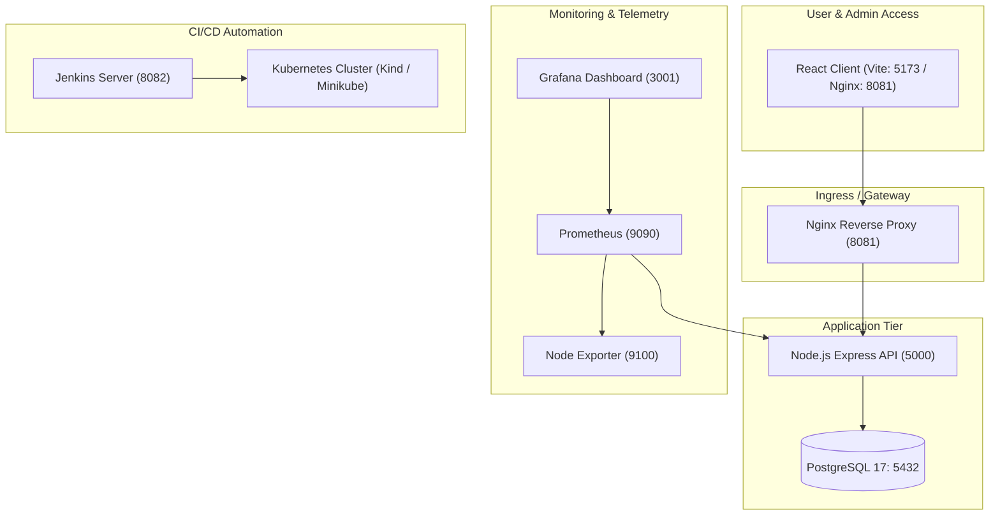

# 🚀 CloudOps - Observability & SRE Incident Management Platform

CloudOps is an enterprise-grade SRE (Site Reliability Engineering) observability dashboard and incident management platform. It includes real-time health metrics, automated chaos testing endpoints, Prometheus/Grafana monitoring with auto-provisioned dashboards, a multi-container Docker Compose architecture, Kubernetes manifests with HPA auto-scaling, and a full Jenkins CI/CD pipeline with automated zero-downtime rollouts and failure rollbacks.

---

## 🛠️ Tech Stack & Architecture

- **Frontend**: React 18, Vite, Tailwind CSS / Vanilla CSS, Lucide Icons
- **Backend**: Node.js, Express.js, PostgreSQL (`pg`), `prom-client` telemetry metrics
- **Database**: PostgreSQL 17 (with automated `node-pg-migrate` execution)
- **Monitoring & Observability**: Prometheus, Grafana (with auto-provisioned Prometheus datasource & JSON dashboards), Node Exporter
- **Containerization**: Docker & Docker Compose
- **Orchestration**: Kubernetes (Kind / Minikube) with Kustomize, HPA, Ingress, and PVC
- **CI/CD Pipeline**: Jenkins (Automated build, test, Docker Hub push, Kubernetes rollout/rollback, and health validation)



---

## 📌 Service Port Mapping

| Service Name | Container Port | Host Port | Description |
|---|---|---|---|
| **CloudOps Client** | `5173` | `http://localhost:5173` | Frontend SRE Dashboard |
| **CloudOps API** | `5000` | `http://localhost:5000` | Backend REST API & Telemetry (`/health`, `/metrics`) |
| **Nginx Gateway** | `80` | `http://localhost:8081` | Reverse Proxy Entry Endpoint |
| **PostgreSQL DB** | `5432` | `localhost:5432` | Primary Database |
| **Prometheus** | `9090` | `http://localhost:9090` | Telemetry Metrics Scraper |
| **Grafana** | `3000` | `http://localhost:3001` | Provisioned Dashboards (`admin`/`admin`) |
| **Node Exporter** | `9100` | `http://localhost:9100` | System Metrics Exporter |
| **Jenkins CI/CD** | `8080` | `http://localhost:8082` | Continuous Delivery Server |

---

## 🐣 Zero-Prerequisite Setup Guide (Fresh PC / Mac / Linux)

If you are setting up this project on a brand new computer with **no tools installed** (no Docker, no WSL, no Git, no Node.js), follow these step-by-step instructions.

### Step 1: Install Git & Node.js
- **Windows**:
  1. Download & run the installer from **[git-scm.com](https://git-scm.com/download/win)**.
  2. Download & run Node.js LTS installer from **[nodejs.org](https://nodejs.org/)**.
- **macOS**:
  1. Open Terminal and run `xcode-select --install` (installs Git).
  2. Download Node.js LTS installer from **[nodejs.org](https://nodejs.org/)** or use Homebrew (`brew install node`).
- **Linux (Ubuntu/Debian)**:
  ```bash
  sudo apt update && sudo apt install -y git nodejs npm
  ```

### Step 2: Install WSL 2 & Docker Desktop (Crucial for Windows)
- **Windows Users**:
  1. Open **PowerShell as Administrator** and execute:
     ```powershell
     wsl --install
     ```
  2. **Restart your computer** when prompted.
  3. Download **Docker Desktop** from **[docker.com/products/docker-desktop](https://www.docker.com/products/docker-desktop/)** and run installer.
  4. Launch **Docker Desktop** and ensure the status bar says **"Docker Desktop is running"** (Green icon).
- **macOS Users**:
  1. Download **Docker Desktop for Mac** (select Apple Silicon or Intel chip).
  2. Drag Docker to Applications and launch it.
- **Linux Users**:
  ```bash
  sudo apt update && sudo apt install -y docker.io docker-compose-v2
  sudo usermod -aG docker $USER
  ```
  *(Log out and log back in to apply group permissions)*

### Step 3: Install Cloudflared (Optional, for GitHub Webhooks)
- **Windows**: Run in Command Prompt / PowerShell:
  ```cmd
  winget install Cloudflare.cloudflared
  ```
- **macOS**: `brew install cloudflare/cloudflare/cloudflared`
- **Linux**: Download `.deb` from [cloudflared releases](https://github.com/cloudflare/cloudflared/releases).

---

## 🚀 Option 1: Quick Start with Docker Compose (Recommended)

Once Docker Desktop is running, launch the entire platform (Client, API, Database, Nginx, Prometheus, Grafana, Node Exporter, Jenkins) with a single command:

### 1. Clone the repository
```bash
git clone https://github.com/shivanshks06/cloudops.git
cd cloudops
```

### 2. Start all services
```bash
docker compose up -d --build
```

### 3. Verify running containers
```bash
docker ps
```

### 4. Access the platform
- **Frontend Dashboard**: [http://localhost:5173](http://localhost:5173) or [http://localhost:8081](http://localhost:8081)
- **API Health Check**: [http://localhost:5000/health](http://localhost:5000/health)
- **Prometheus Metrics**: [http://localhost:5000/metrics](http://localhost:5000/metrics)
- **Prometheus Scraper**: [http://localhost:9090](http://localhost:9090)
- **Grafana Dashboards**: [http://localhost:3001](http://localhost:3001) *(Login: `admin` / `admin`)*
- **Jenkins CI/CD**: [http://localhost:8082](http://localhost:8082)

---

## 💻 Option 2: Native Local Development (Node.js)

If you wish to modify the code locally with live hot-reloading:

### 1. Start PostgreSQL Database
```bash
docker compose up -d db
```

### 2. Configure & Start Backend API
```bash
cd server
npm install
npm run migrate # Runs database migrations
npm run dev     # Starts Express server on port 5000
```

### 3. Configure & Start Frontend Client
In a new terminal window:
```bash
cd client
npm install
npm run dev     # Starts Vite server on port 5173
```

---

## ☸️ Option 3: Deploy to Kubernetes

Deploy the CloudOps application stack to a local Kubernetes cluster using Kustomize.

### 1. Start your local Kubernetes cluster
Using **Kind**:
```bash
kind create cluster --name cloudops
```
Or using **Minikube**:
```bash
minikube start
```

### 2. Apply all Kubernetes manifests
```bash
kubectl apply -k k8s/
```

### 3. Verify deployment status
```bash
kubectl get all -n cloudops
```

### 4. Access the application in Kubernetes
Port-forward the client service:
```bash
kubectl port-forward svc/cloudops-client-service 5173:80 -n cloudops
```
Open your browser at [http://localhost:5173](http://localhost:5173).

---

## 🔄 Jenkins CI/CD Pipeline Setup

The project includes a production-grade declarative `Jenkinsfile` that automates testing, building Docker images with dynamic build numbers, pushing to Docker Hub, updating Kubernetes deployments, and executing rollbacks on failure.

### 1. Access Jenkins
Open [http://localhost:8082](http://localhost:8082) in your browser.

### 2. Configure Credentials in Jenkins (Optional)
Go to **Manage Jenkins** -> **Credentials** -> **System** -> **Global credentials**:
- **Docker Hub Credentials**:
  - **Kind**: `Username with password`
  - **ID**: `dockerhub-creds`
  - **Username/Password**: Your Docker Hub credentials.
- **Kubernetes Config**:
  - **Kind**: `Secret file`
  - **ID**: `kubeconfig`
  - **File**: Upload your cluster's `kubeconfig` file.

### 3. Setting Up GitHub Webhook (via Cloudflare Tunnel)

Since Jenkins runs locally on `http://localhost:8082`, GitHub requires a public HTTPS URL to deliver push events. You can generate a free public tunnel using **Cloudflare Tunnel**:

#### Step 1: Start Cloudflare Tunnel
```bash
cloudflared tunnel --url http://localhost:8082
```
Cloudflare will output a public HTTPS URL (e.g. `https://abc123.trycloudflare.com`). Keep this terminal window open.

#### Step 2: Configure Webhook in GitHub
1. Go to **GitHub** -> **Your Repository** -> **Settings** -> **Webhooks** -> **Add Webhook**.
2. **Payload URL**: `https://<your-cloudflare-subdomain>.trycloudflare.com/github-webhook/`
3. **Content type**: `application/json`
4. **Secret**: Leave empty
5. **Events**: Select **Just the push event**
6. Click **Add Webhook**.

#### Step 3: Enable Webhook Trigger in Jenkins
1. Open Jenkins at [http://localhost:8082](http://localhost:8082).
2. Open your project job -> **Configure** -> **Build Triggers**.
3. Check **GitHub hook trigger for GITScm polling**.
4. Save the job. Now every `git push` automatically runs your full CI/CD pipeline!

### 4. Pipeline Stages
1. **Checkout**: Pulls latest repository code.
2. **Verify Tools**: Validates Git, Node, Docker, and Docker Compose versions.
3. **Dependencies & React Build**: Installs node modules and builds frontend assets.
4. **Backend Verification**: Syntax and structural checks.
5. **Docker Build & Push**: Builds tagged images (`cloudops-api:BUILD_NUMBER` & `cloudops-client:BUILD_NUMBER`) and pushes to Docker Hub.
6. **Deploy Application**: Applies Kubernetes manifests or updates Docker Compose services.
7. **Health Verification**: Runs end-to-end HTTP health checks (`/health`).
8. **Automated Rollback**: Triggers `kubectl rollout undo` if deployment or health verification fails.

---

## 📈 Observability & Grafana Dashboard Provisioning

Grafana is pre-configured with auto-provisioned datasources and dashboards:
- **Datasource Config**: `monitoring/grafana/provisioning/datasources/datasource.yml` (Connects Grafana directly to `http://prometheus:9090`).
- **Dashboard JSON**: `monitoring/grafana/provisioning/dashboards/cloudops-dashboard.json` (Pre-loads dashboard `adj2xlj` featuring Total Services, Active Alerts, Active Incidents, and Service Response Time).
- **Anonymous Embedding**: Enabled (`GF_AUTH_ANONYMOUS_ENABLED=true`, `GF_SECURITY_ALLOW_EMBEDDING=true`) for seamless iframe viewing in the React frontend.

---

## 🔧 Troubleshooting

- **Database Connection Failure**: Ensure the database health check passes. Run `docker compose logs db` to inspect PostgreSQL logs.
- **Jenkins cannot reach Kubernetes**: Ensure `server` URL in `kubeconfig` uses `https://cloudops-control-plane:6443` or `https://host.docker.internal:<port>` depending on your container setup.
- **Port Conflict**: If port `5000`, `5173`, `8081`, `5432`, `9090`, `3001`, or `8082` is already in use on your system, update the host port mappings in `compose.yml`.

---

## 📄 License

This project is open source and available under the [MIT License](LICENSE).